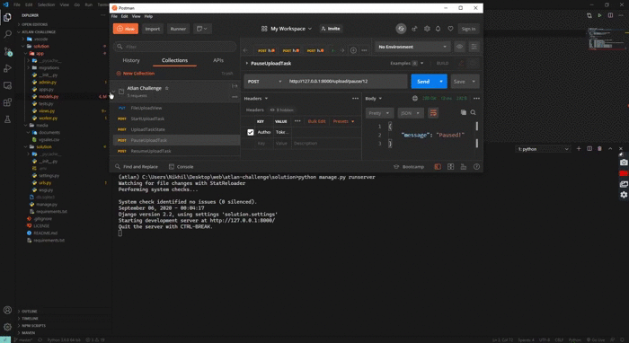
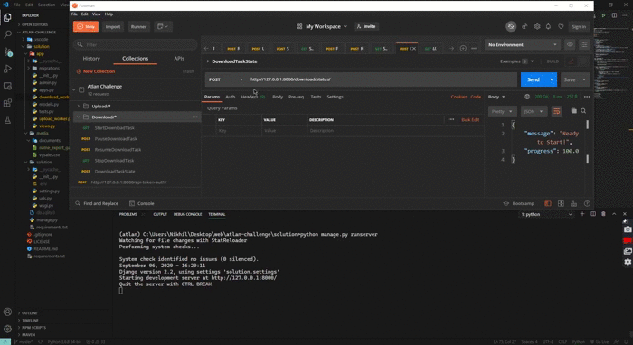

<h1 align="center">
    Atlan Challenge
</h1>
<p align="center">An implementation through which the user can now stop the long-running task at any given point in time, and can choose to resume or terminate it. This will ensure that the resources like compute/memory/storage/time are used efficiently at our end, and do not go into processing tasks that have already been stopped (and then to roll back the work done post the stop-action)</p>

<p align="center">
  <a href="#demo">Demo</a> •
  <a href="#salient-features">Salient Features</a> •
  <a href="#how-to-setup">How To Setup</a> •
  <a href="#credits">Credits</a> •
  <a href="#license">License</a>
</p>

### Demo
Upload Task



Download Task



### Salient Features
* Full-Control over long running tasks
* Upload and Download CSV file support
* Packaged with a dockerfile for easy deployment
* Secure _Token Authentication_ over API Endpoints
* Works with SQLite, PostgresSQL, MySQL (any database that supports _Django's ORM_)

### How to Setup
* First clone the project, open your terminal and enter the command

```bash
git clone https://github.com/itsnikhil/atlan-challenge.git
```
* Now enter into the project folder
```bash
cd atlan-challenge/
```
* Create .env file inside solution folder. Copy content from sample.env and add YOUR_SECRET_KEY

(Linux/ MacOS)
```
cd solution/solution
cat sample.env > .env
```
(Windows)
```
cd solution/solution
type sample.env > .env
```
**Open `.env` file and replace `YOUR_SECRET_KEY` with a key of your own**

__Note:__ `SECRET_KEY` is a random string of characters that is created when a project in Django is created. Technically, you could make the key literally anything you want but it should be hard to guess and long enough to increase the entropy of your hashes.

* Build the services defined in the docker-compose.yml
```bash
cd ../..
docker-compose up -d --build
```

* Make Migrations
```
docker-compose exec web python ./solution/manage.py makemigrations
docker-compose exec web python ./solution/manage.py migrate
```

* Create Super User
```
docker-compose exec web python ./solution/manage.py createsuperuser
```

* Now go to http://localhost:8000/ you'll see list of all endpoints
* You can login to admin with that user you've just created by going to http://localhost:8000/admin

For testing purposes [use this csv file](solution/media/documents/vgsales.csv)

### API Doc
Endpoints:
+ admin/
+ api-token-auth/
+ upload/<str:filename>
+ upload/start/<int:file_id>
+ upload/status/<int:file_id>
+ upload/pause/<int:file_id>
+ upload/resume/<int:file_id>
+ upload/stop/<int:file_id>
+ download/start/
+ download/status/
+ download/pause/
+ download/resume/
+ download/stop/
+ ^media\/(?P<path>.*)$

[API Documentation](https://documenter.getpostman.com/view/12623083/TVCiSRip) - Some endpoints might be restricted and connot be accessed directly. See in detail at postman 

### Credits
This software uses the following open source packages:

- [Python](https://www.python.org/)
- [Django](https://www.djangoproject.com/)
- [Docker](https://www.docker.com/)
- [Django Rest Framework](https://www.django-rest-framework.org/)

### License
MIT

### Author
[Nikhil Taneja](https://itsnikhil.pythonanywhere.com)

[Contact](mailto:taneja.nikhil03@gmail.com)